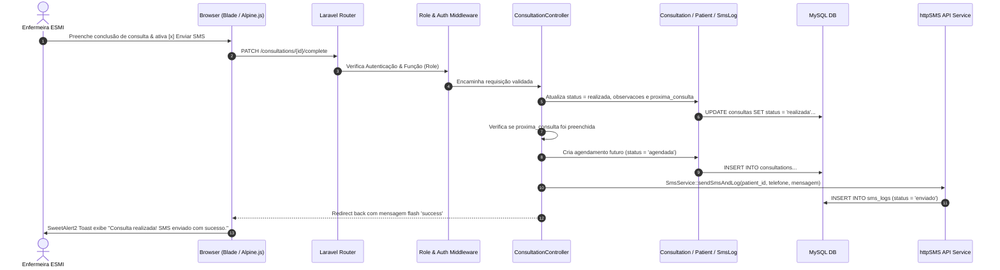

# 🔄 Ciclo de Vida da Requisição — Maternidade+

Fluxo detalhado de processamento de uma requisição HTTP no **Maternidade+**.

---

## 🔁 Diagrama de Sequência de Atendimento Clínico & Envio de SMS

```mermaid
sequenceDiagram
    autonumber
    actor Nurse as Enfermeira ESMI
    participant Browser as Browser (Blade / Alpine.js)
    participant Router as Laravel Router
    participant Middleware as Role & Auth Middleware
    participant Controller as ConsultationController
    participant Model as Consultation / Patient / SmsLog
    participant DB as MySQL DB
    participant SMS as httpSMS API Service

    Nurse->>Browser: Preenche conclusão de consulta & ativa [x] Enviar SMS
    Browser->>Router: PATCH /consultations/{id}/complete
    Router->>Middleware: Verifica Autenticação & Função (Role)
    Middleware->>Controller: Encaminha requisição validada
    Controller->>Model: Atualiza status = realizada, observacoes e proxima_consulta
    Model->>DB: UPDATE consultas SET status = 'realizada'...
    Controller->>Controller: Verifica se proxima_consulta foi preenchida
    Controller->>Model: Cria agendamento futuro (status = 'agendada')
    Model->>DB: INSERT INTO consultations...
    Controller->>SMS: SmsService::sendSmsAndLog(patient_id, telefone, mensagem)
    SMS->>DB: INSERT INTO sms_logs (status = 'enviado')
    Controller-->>Browser: Redirect back com mensagem flash 'success'
    Browser->>Nurse: SweetAlert2 Toast exibe "Consulta realizada! SMS enviado com sucesso."
```
