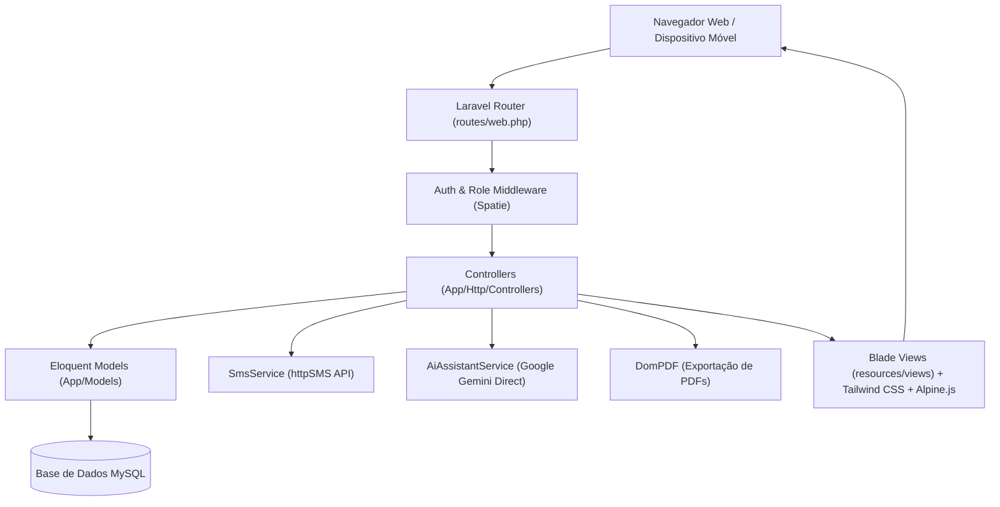

# 🏗️ Arquitetura do Sistema — Maternidade+

O **Maternidade+** foi desenvolvido adotando a arquitetura em camadas no padrão **MVC (Model-View-Controller)** com serviços desacoplados para integrações externas (SMS, Inteligência Artificial, Relatórios PDF).

---

## 📐 Visão Geral dos Componentes

---

## 🔒 Camada de Controlo de Acesso (RBAC)

O controlo de acessos a rotas e menus é regulado pela biblioteca `Spatie/laravel-permission`:
- Rotas sensíveis (como `/users` e `/settings`) são estritamente protegidas por `middleware('role:Administrador')`.
- O menu lateral no layout `resources/views/layouts/app-tw.blade.php` adapta-se dinamicamente às permissões do utilizador autenticado via directivas `@hasrole`.
