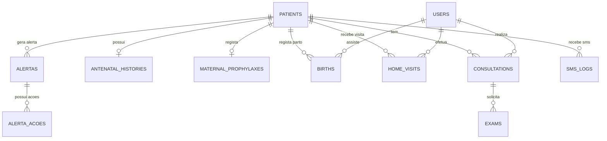

# 📊 Diagrama Entidade-Relacionamento (ER) — Maternidade+

Diagrama Mermaid das relações entre as tabelas principais da base de dados.

```mermaid
erDiagram
    PATIENTS ||--o{ CONSULTATIONS : "tem"
    PATIENTS ||--o| ANTENATAL_HISTORIES : "possui"
    PATIENTS ||--o| MATERNAL_PROPHYLAXES : "regista"
    PATIENTS ||--o{ BIRTHS : "regista parto"
    PATIENTS ||--o{ HOME_VISITS : "recebe visita"
    PATIENTS ||--o{ ALERTAS : "gera alerta"
    PATIENTS ||--o{ SMS_LOGS : "recebe sms"

    USERS ||--o{ CONSULTATIONS : "realiza"
    USERS ||--o{ BIRTHS : "assiste"
    USERS ||--o{ HOME_VISITS : "efetua"

    CONSULTATIONS ||--o{ EXAMS : "solicita"
    ALERTAS ||--o{ ALERTA_ACOES : "possui acoes"
```
