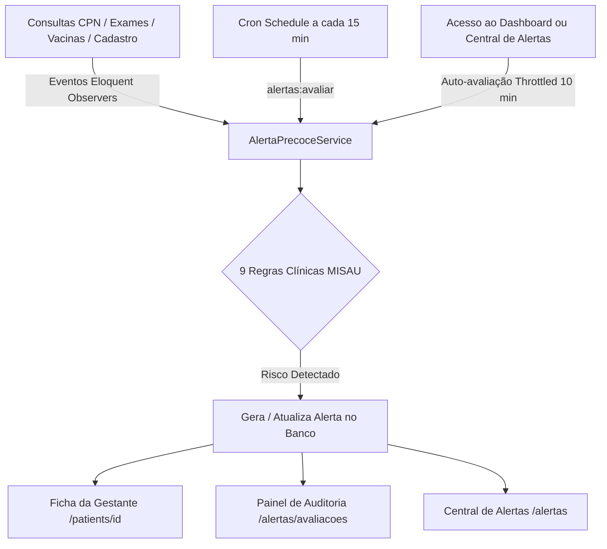
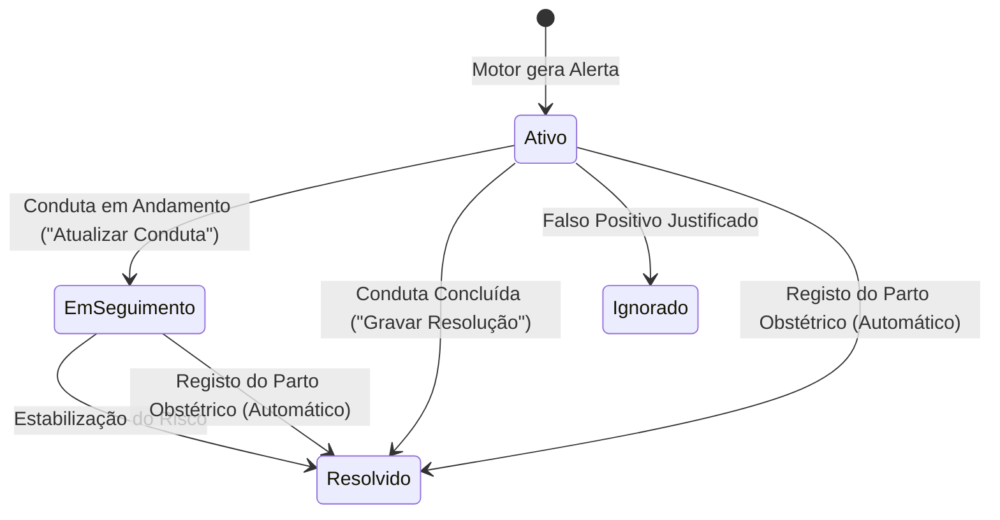

# 🚨 Motor de Alertas Clínicos Precoces & Fluxo Obstétrico (MISAU)

Este documento descreve detalhadamente a arquitetura, as regras de negócio clínicas baseadas em evidência do Ministério da Saúde de Moçambique (MISAU), a origem dos dados de triagem, o ciclo de vida dos alertas no prontuário da paciente e a transição entre gestação, parto e puerpério.

---

## 📌 1. Visão Geral da Arquitetura

O sistema **Maternidade+** possui um motor contínuo e proativo de triagem e vigilância materno-fetal (`App\Services\AlertaPrecoceService`), operando em 3 camadas de execução:

1. **Observers de Modelos (`PatientObserver`, `ConsultationObserver`, `ExamObserver`, `VaccineObserver`)**: Disparam a reavaliação imediata da paciente assim que novos dados clínicos são inseridos.
2. **Cron Scheduler em Background (`routes/console.php` / `Kernel.php`)**: Executa `php artisan alertas:avaliar` a cada 15 minutos para monitorar a passagem do tempo (gestantes que se tornaram faltosas ou ultrapassaram as 41 semanas).
3. **Trigger Proativo Throttled (10 min)**: Garante a avaliação automática ao aceder ao Dashboard ou à Central de Alertas.

---

## 🩺 2. As 9 Regras Clínicas e Origem dos Dados

| # | Regra Clínica | Gatilho & Ponto de Corte | Origem dos Dados | Nível | Conduta Esperada |
|---|---|---|---|---|---|
| **1** | **Pressão Arterial Crítica / Pré-eclâmpsia** | PA Sistólica $\ge 160$ ou Diastólica $\ge 110$ mmHg (Grave); PA $\ge 140/90$ mmHg (Atenção) | Consulta CPN (`pressao_arterial`) | 🔴 Alto / 🟡 Médio | Avaliação médica urgente, sulfato de magnésio, anti-hipertensivo e monitoria fetal. |
| **2** | **Batimentos Cardíacos Fetais (BCF) Anormais** | BCF $< 110$ ou $> 160$ bpm | Consulta CPN (`batimentos_fetais`) | 🔴 Alto | Rastreio de sofrimento fetal agudo, decúbito lateral esquerdo, oxigenoterapia e ecografia. |
| **3** | **Gestante Faltosa / Abandono de CPN** | $\ge 3$ dias após consulta agendada OU $> 30$ dias sem qualquer atendimento na US | Consultas CPN (`data_consulta`, `proxima_consulta`) | 🟡 Médio | Disparo de busca ativa comunitária com Agentes Polivalentes de Saúde (APEs). |
| **4** | **Alto Risco Obstétrico (ARO) Desacompanhado** | Gestante ARO (histórico de abortos, diabetes, cesariana anterior) $> 30$ dias sem CPN | Cadastro FPN & Consultas | 🔴 Alto | Convocação imediata e encaminhamento para consulta de obstetrícia especializada. |
| **5** | **Vacinação Atrasada** | Doses de VAT (Tétano) pendentes além da data prevista | Módulo de Vacinas (`Vaccine`) | 🔵 Baixo | Administração imediata da dose na triagem ou CPN subsequente. |
| **6** | **Laboratório Crítico (HIV, Sífilis, Anemia)** | HIV+, Sífilis (VDRL+) ou Hemoglobina $< 7.0$ g/dL | Módulo de Exames (`Exam`) / Profilaxias | 🔴 Alto | Início imediato de TARV/PTV, Penicilina Benzatínica (casal) e tratamento de anemia severa. |
| **7** | **Ganho/Perda de Peso Anormal** | Variação rápida desproporcional ou perda contínua de peso | Consultas CPN (`peso_atual`) | 🟡 Médio | Avaliação nutricional, despiste de hiperémese, tuberculose ou desnutrição grave. |
| **8** | **Pós-Termo Sem Registo de Parto** | Idade Gestacional $> 41$ semanas sem registo de nascimento | DUM (`data_ultima_menstruacao`) / CPN | 🔴 Alto | Indução do parto ou cesariana para prevenir sofrimento fetal pós-maturidade. |
| **9** | **Sangramento Obstétrico / Hemorragia** | Menção afirmativa a sangramento/hemorragia vaginal viva | Observações e Queixas da CPN | 🔴 Alto | Urgência: despiste de Placenta Prévia, Descolamento Prematuro da Placenta (DPP) ou Rotura Uterina. |

### 🧠 Como Funciona o Parser de Linguagem Natural (Exclusão de Negações):
Para a regra de sangramento, o sistema aplica Expressões Regulares Inteligentes que diferenciam relatos positivos de termos de negação médica:
- **Exemplo 1**: *"Gestante refere queixa de sangramento vaginal vivo no 3º trimestre"* ➔ **Gera Alerta Imediato** 🔴.
- **Exemplo 2**: *"Paciente nega sangramento, sem queixas de perda hemática"* ➔ **Não Gera Alerta** (o sistema reconhece a negação clínica e não cria falsos alarmes).

---

## 💻 3. Ciclo de Vida e Resolução no Prontuário (`/patients/{id}`)

O profissional de saúde não necessita de alternar entre páginas para gerir o risco da paciente. O tratamento ocorre diretamente na **Ficha da Gestante**:

1. **Abertura do Modal**:
   - Clicar em **"Tratar / Resolver"** marca o alerta automaticamente como lido no backend e abre a janela de conduta clínica.
2. **Seleção de Status**:
   - 🟢 **Resolvido**: A conduta foi finalizada e o risco controlado (ex: medicação administrada, ecografia realizada).
   - 🟡 **Em Seguimento**: A conduta foi iniciada mas a gestante requer vigilância ativa (o botão na ficha muda dinamicamente para **"🔄 Atualizar Conduta"**).
   - ⚪ **Ignorado**: Justificativa médica de parâmetro espúrio ou erro de registo.
3. **Registo Obrigatório de Auditoria**: O sistema exige a descrição textual da conduta médica para efeitos de auditoria clínica e responsabilidade médico-legal.
4. **Sincronização em Tempo Real**: Atualiza instantaneamente a ficha, a Central de Alertas (`/alertas`) e o Painel de Avaliações (`/alertas/avaliacoes`).

---

## 👶 4. Transição de Parto & Fase Pós-Parto (Puerpério)

### **A. Registo de Parto Obstétrico (`/births/create`)**:
- A partir da ficha da paciente ou do modal de conduta, o profissional pode clicar em **"👶 Registar Parto"**.
- Ao gravar o nascimento:
  1. **Encerramento Automático**: Todos os alertas gestacionais ativos (*Pós-Termo*, *Faltosa CPN*, *Apresentação Anormal*) são marcados como **`Resolvido`** com a nota: *"Parto registado com sucesso. Paciente transferida para acompanhamento pós-parto (puerpério)"*.
  2. **Geração Automática do Puerpério MISAU**: São agendadas automaticamente as 3 consultas pós-parto:
     - **1ª Consulta de Puerpério (48 horas)**: Involução uterina, lóquios, início do aleitamento e alta da maternidade.
     - **2ª Consulta de Puerpério (7 dias)**: Cicatrização do períneo/cesariana, sinais de infecção e triagem do recém-nascido.
     - **3ª Consulta de Puerpério (28 dias / 6 semanas)**: Planeamento familiar pós-parto, vacinação do lactente e alta puerperal.
  3. **Histórico Preservado**: Fica disponível na secção retrátil **"📜 Histórico de Alertas Resolvidos / Partos Concluídos"** na ficha da paciente.

---

## 📊 5. Relatórios & Painel de Auditoria

- **Painel de Avaliações Clínicas (`/alertas/avaliacoes`)**: Quadro nominal de triagem para conferência médica e exportação da auditoria em PDF A4 Paisagem.
- **Central de Relatórios MISAU (`/reports`)**: Consolidação estatística de CPN, Profilaxias (IPTp-SP, REMTIL, Nutrição), Maternidade, PTV/HIV, Busca Ativa com APEs e Livros Oficiais (MOD-SIS-B01 e B01-B).
